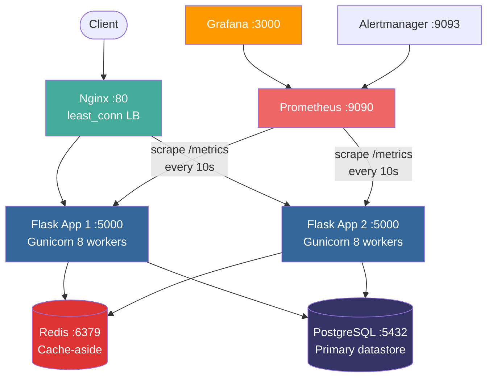
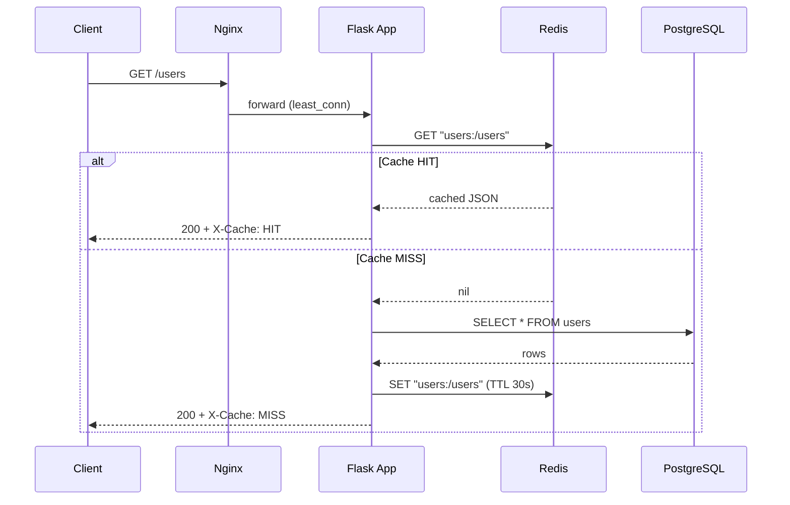
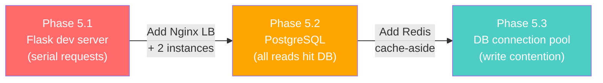

# Farmers URL Shortener

> A production-grade URL shortener built with SRE principles — load-balanced, cached, monitored, and self-healing.

**Stack:** Python 3.13 · Flask 3.1 · Peewee ORM · PostgreSQL 16 · Redis 7 · Nginx · Prometheus · Grafana · Docker Compose · k6

**Team Farmers** — MLH Production Engineering Hackathon 2026

---

## Table of Contents

- [Quick Start](#quick-start)
- [Full Production Stack](#full-production-stack)
- [Architecture](#architecture)
- [API Documentation](#api-documentation)
- [Environment Variables](#environment-variables)
- [Deployment & Rollback](#deployment--rollback)
- [Observability](#observability)
- [Operational Runbook](#operational-runbook)
- [Troubleshooting](#troubleshooting)
- [Technical Decision Log](#technical-decision-log)
- [Capacity Plan & Known Limits](#capacity-plan--known-limits)
- [Testing](#testing)
- [Project Structure](#project-structure)
- [Team](#team)

---

## Quick Start

### Prerequisites

- **Python 3.13+**
- **uv** — fast Python package manager
  ```bash
  # macOS / Linux
  curl -LsSf https://astral.sh/uv/install.sh | sh

  # Windows (PowerShell)
  powershell -ExecutionPolicy ByPass -c "irm https://astral.sh/uv/install.ps1 | iex"
  ```
- **Docker** and **Docker Compose** (for the full production stack)
- **k6** (for load testing, optional)

### Local Development (DB + Redis only)

```bash
# 1. Clone the repo
git clone <repo-url> && cd PE-Hackathon-Template-2026-Farmers

# 2. Install dependencies
uv sync

# 3. Start PostgreSQL and Redis
docker-compose up -d db redis

# 4. Configure environment
cp .env.example .env   # edit if your DB credentials differ

# 5. Run the server
uv run run.py

# 6. Verify
curl http://localhost:5000/health
# → {"status": "ok", "db": "ok", "redis": "ok"}
```

### Load Seed Data

The hackathon provides `users.csv` (400 rows), `urls.csv` (2000 rows), and `events.csv` (3422 rows):

```bash
uv run scripts/load_csv_data.py
```

### Run Tests

```bash
uv run pytest tests/ -x --tb=short -q
# 70 tests, 82% coverage, --cov-fail-under=70 enforced
```

---

## Full Production Stack

One command brings up **8 containers**: 2 Flask app servers, Nginx load balancer, PostgreSQL, Redis, Prometheus, Grafana, and Alertmanager.

```bash
docker-compose up -d --build
```

| Service | URL | Credentials |
|---|---|---|
| **App (via Nginx)** | http://localhost:80 | — |
| **Prometheus** | http://localhost:9090 | — |
| **Grafana** | http://localhost:3000 | admin / hackathon |
| **Alertmanager** | http://localhost:9093 | — |

Verify everything is healthy:

```bash
docker ps --format "table {{.Names}}\t{{.Status}}\t{{.Ports}}"
curl http://localhost/health
# → {"status": "ok", "db": "ok", "redis": "ok"}
```

---

## Architecture



**Key design choices:**
- **Nginx `least_conn`** routes each request to the instance with the fewest active connections — better than round-robin for mixed workloads (bulk CSV imports are slow, health checks are fast)
- **Redis cache-aside** on `GET /users` (TTL 30s) and `GET /urls` (TTL 15s) — cache misses self-heal by querying PostgreSQL and populating the cache
- **`/metrics` blocked at Nginx** (403) — Prometheus scrapes directly on the internal Docker network
- **`restart: unless-stopped`** on all app containers — self-healing without Kubernetes

### Cache-Aside Flow



---

## API Documentation

### Health

| Method | Path | Description | Response |
|---|---|---|---|
| `GET` | `/health` | Deep health check (DB + Redis) | `200` ok / `503` degraded |

```bash
curl http://localhost/health
# → {"status": "ok", "db": "ok", "redis": "ok"}
```

### Users

| Method | Path | Description | Success | Errors |
|---|---|---|---|---|
| `GET` | `/users` | List all users (supports `page`, `per_page`, `username`, `email` query params) | `200` | — |
| `GET` | `/users/<id>` | Get a single user | `200` | `404` |
| `POST` | `/users` | Create a user | `201` | `400` `409` `422` |
| `PUT` | `/users/<id>` | Update a user (partial) | `200` | `404` `409` `422` |
| `DELETE` | `/users/<id>` | Delete a user | `204` | `404` |
| `POST` | `/users/bulk` | Bulk import users via CSV upload | `200` | `400` |

**Create user:**
```bash
curl -X POST http://localhost/users \
  -H "Content-Type: application/json" \
  -d '{"username": "alice", "email": "alice@example.com"}'
# → 201 {"id": 401, "username": "alice", "email": "alice@example.com", "created_at": "..."}
```

**Bulk CSV import:**
```bash
curl -X POST http://localhost/users/bulk \
  -F "file=@users_upload.csv"
# → 200 {"imported": 50}
# CSV format: username,email (one per line, header required)
# Malformed/duplicate rows are skipped, not crashed on
```

**Error responses:**

| Status | Meaning | Example |
|---|---|---|
| `409` | Duplicate username or email | `{"error": "Username already exists"}` |
| `422` | Validation failure | `{"error": "Validation failed", "details": {"email": "Invalid email"}}` |
| `400` | Missing/malformed JSON body | `{"error": "Request body must be JSON"}` |

### URLs

| Method | Path | Description | Success | Errors |
|---|---|---|---|---|
| `GET` | `/urls` | List all URLs (supports `user_id`, `is_active`, `short_code`, `title`, `page`, `per_page`) | `200` | `404` |
| `GET` | `/urls/<id>` | Get a single URL | `200` | `404` |
| `POST` | `/urls` | Create a short URL | `201` | `404` `422` |
| `PUT` | `/urls/<id>` | Update a URL (partial: `title`, `original_url`, `is_active`) | `200` | `404` `422` |
| `DELETE` | `/urls/<id>` | Delete a URL | `204` | `404` |
| `GET` | `/urls/<id>/stats` | Get visit stats for a URL | `200` | `404` |
| `GET` | `/urls/<id>/events` | Get events for a URL | `200` | `404` |
| `GET` | `/<short_code>` | Redirect to original URL | `302` | `404` |

**Create URL:**
```bash
curl -X POST http://localhost/urls \
  -H "Content-Type: application/json" \
  -d '{"original_url": "https://github.com", "user_id": 1, "title": "GitHub"}'
# → 201 {"id": 2001, "short_code": "aB3xYz", "original_url": "https://github.com", ...}
```

**Redirect:**
```bash
curl -L http://localhost/aB3xYz
# → 302 redirect to https://github.com
```

### Events

| Method | Path | Description | Success | Errors |
|---|---|---|---|---|
| `GET` | `/events` | List all events (supports `url_id`, `user_id`, `event_type`, `page`, `per_page`) | `200` | — |
| `GET` | `/events/<id>` | Get a single event | `200` | `404` |
| `POST` | `/events` | Create an event | `201` | `400` `404` `422` |
| `PUT` | `/events/<id>` | Update an event | `200` | `404` `422` |
| `PATCH` | `/events/<id>` | Partial update (same as PUT) | `200` | `404` `422` |
| `DELETE` | `/events/<id>` | Delete an event | `204` | `404` |

**Event types:** `created`, `updated`, `deactivated`, `visited`

### Metrics

| Method | Path | Description |
|---|---|---|
| `GET` | `/metrics` | Prometheus metrics (blocked via Nginx — accessible only on internal Docker network) |

---

## Environment Variables

| Variable | Required | Default | Description |
|---|---|---|---|
| `DATABASE_NAME` | Yes | `hackathon_db` | PostgreSQL database name |
| `DATABASE_HOST` | Yes | `localhost` | PostgreSQL host |
| `DATABASE_PORT` | No | `5432` | PostgreSQL port |
| `DATABASE_USER` | No | `postgres` | PostgreSQL user |
| `DATABASE_PASSWORD` | No | `postgres` | PostgreSQL password |
| `REDIS_URL` | No | `redis://localhost:6379/0` | Redis connection URL for caching |
| `FLASK_RUN_HOST` | No | `127.0.0.1` | Flask bind address |
| `SECRET_KEY` | No | — | Flask secret key (set in production) |
| `GF_SECURITY_ADMIN_PASSWORD` | No | `hackathon` | Grafana admin password |

Copy the example file and edit as needed:

```bash
cp .env.example .env
```

---

## Deployment & Rollback

### Deploy (Docker Compose)

```bash
# 1. Pull latest code
git pull origin main

# 2. Build and deploy
docker-compose up -d --build

# 3. Verify health
curl http://localhost/health
# → {"status": "ok", "db": "ok", "redis": "ok"}

# 4. Check all containers are running
docker ps --format "table {{.Names}}\t{{.Status}}"
```

### Rollback

If a deployment introduces errors:

```bash
# 1. Identify the last known good commit
git log --oneline -5

# 2. Checkout previous version
git checkout <previous_sha>

# 3. Rebuild only the app containers (DB stays untouched)
docker-compose up -d --build app1 app2

# 4. Verify recovery
curl http://localhost/health

# 5. Return to main when a fix is ready
git checkout main
```

### Rebuild a Single Service

```bash
# Rebuild just the app containers (after code changes)
docker-compose up -d --build app1 app2

# Restart Nginx (after nginx.conf changes)
docker-compose restart nginx

# Restart the database (use with caution — data is preserved in volume)
docker-compose restart db
```

---

## Observability

### Structured Logging

All application logs are JSON-formatted via `python-json-logger`, written to stdout:

```json
{
  "asctime": "2026-04-05 14:30:00",
  "levelname": "INFO",
  "name": "app",
  "message": "request_completed",
  "method": "GET",
  "path": "/users",
  "status": 200,
  "duration_ms": 12.45
}
```

View logs:
```bash
docker-compose logs --tail=50 app1 app2
```

### Prometheus Metrics

Flask automatically exposes via `prometheus-flask-exporter`:
- `flask_http_request_total` — request counter by method, status, path
- `flask_http_request_duration_seconds` — latency histogram (p50, p95, p99)
- `app_info` — app version metadata

Prometheus scrapes both `app1:5000/metrics` and `app2:5000/metrics` every 10 seconds.

### Grafana Dashboard

The **"URL Shortener — Four Golden Signals"** dashboard is auto-provisioned from `monitoring/grafana/dashboards/url-shortener.json`:

| Panel | Golden Signal | Query |
|---|---|---|
| Traffic (Request Rate) | Traffic | `rate(flask_http_request_total[1m])` |
| Errors (5xx Rate) | Errors | `rate(flask_http_request_total{status=~"5.."}[1m])` |
| Latency (p50/p95/p99) | Latency | `histogram_quantile(0.95, rate(..._bucket[5m]))` |
| Endpoint Breakdown | Saturation | `rate(flask_http_request_total[5m]) by (path)` |

### Alert Rules

Three Prometheus alerts defined in `monitoring/alert_rules.yml`:

| Alert | Condition | Fires After | Severity |
|---|---|---|---|
| **ServiceDown** | `up{job="url-shortener"} == 0` | 1 minute | Critical |
| **HighErrorRate** | 5xx error rate > 5% | 2 minutes | Warning |
| **HighLatency** | p95 latency > 1 second | 5 minutes | Warning |

---

## Operational Runbook

> Full runbook with detailed triage steps: [`docs/runbook.md`](docs/runbook.md)

### Alert: ServiceDown

**Severity:** Critical | **Impact:** Full outage

1. Check container status: `docker ps -a | grep -E 'app1|app2|nginx'`
2. Restart app instances: `docker-compose restart app1 app2 nginx`
3. Wait 30 seconds, then verify: `curl http://localhost/health`
4. Check logs: `docker-compose logs --tail=50 app1 app2`
5. If DB is down: `docker-compose restart db` — wait for `pg_isready`
6. **Escalate** after 5 minutes if unresolved

### Alert: HighErrorRate

**Severity:** Warning | **Impact:** Degraded service

1. Open Grafana → Endpoint Breakdown panel — identify which endpoint is failing
2. Check logs: `docker-compose logs --tail=100 app1 app2 | findstr ERROR`
3. If `IntegrityError` on POST: expected behavior (409 on duplicates), not a real error
4. If `OperationalError`: database connectivity issue → `docker-compose restart db`
5. If errors started after a deploy: rollback (see [Rollback](#rollback))

### Alert: HighLatency

**Severity:** Warning | **Impact:** Degraded UX

1. Open Grafana → Latency panel — identify the slow endpoint
2. Check resource usage: `docker stats --no-stream`
3. Check Redis cache hit rate: `docker-compose exec redis redis-cli INFO stats`
4. Quick mitigation: `docker-compose restart app1 app2`

### Health Check Returns "degraded"

```bash
curl http://localhost/health
# → {"status": "degraded", "db": "down", "redis": "ok"}
```

1. If `"db": "down"` → `docker-compose restart db`, wait for health check
2. If `"redis": "down"` → `docker-compose restart redis`
3. App continues serving if Redis is down (cache-aside degrades gracefully to DB-only)

---

## Troubleshooting

### Common Issues

| Problem | Symptom | Fix |
|---|---|---|
| **Port 5432 conflict** | `Bind for 0.0.0.0:5432 failed` | We map to `5433` externally. Use `DATABASE_PORT=5433` for local dev, `5432` inside Docker |
| **Flask returns HTML 500** | Test suite gets JSON parse errors | Global error handlers registered for 404/405/413/500 — all return JSON |
| **CSV bulk import skips rows** | `{"imported": 0}` | CSV must have `username,email` header. Invalid/duplicate rows are skipped |
| **Grafana shows empty panels** | Dashboard loads but no data | Wait 60s for Prometheus to scrape. Check http://localhost:9090/targets shows "UP" |
| **`uv run` fails** | `No module named 'app'` | Run from project root. Ensure `uv sync` completed |
| **Stale cached data** | Old response after write | Check `X-Cache` header. Writes trigger `invalidate_cache()`. Keys also expire by TTL |
| **Container restart loop** | `docker ps` shows "Restarting" | Check logs: `docker-compose logs --tail=20 <service>` |
| **Integer username accepted** | Hidden test expects 422 | Validation rejects non-string usernames with 422 + details |

### Bugs We Hit During Development

1. **CSV bulk import counted 396/400 instead of 400** — The seed `users.csv` had 4 duplicate usernames. Fixed by switching from `User.create()` to `User.get_or_create()`.

2. **`GET /events` returned `details` as a string** — The `details` field is stored as JSON text in PostgreSQL. Fix: `json.loads(event.details)` in `serialize_event()`.

3. **Grafana datasource UID mismatch** — Dashboard JSON referenced a hardcoded Prometheus UID that didn't match the auto-provisioned one. Fixed by aligning the UID in the datasource YAML.

4. **Docker startup race condition** — `app1` started before `db` was healthy, causing `OperationalError`. Fixed with `depends_on: db: condition: service_healthy`.

---

## Technical Decision Log

> Additional decision logs: [`docs/api_decision_log.md`](docs/api_decision_log.md) · [`docs/schema_decision_log.md`](docs/schema_decision_log.md) · [`docs/testing_decision_log.md`](docs/testing_decision_log.md)

### ADR-001: Peewee ORM over SQLAlchemy

**Decision:** Use Peewee as the ORM.
**Rationale:** Mandated by hackathon template. Lighter than SQLAlchemy, built-in `create_tables(safe=True)` for idempotent schema creation, sufficient for our three-model schema.
**Tradeoff:** No async support. Acceptable for synchronous Flask.

### ADR-002: Redis Cache-Aside Pattern

**Decision:** Cache `GET /users` (30s TTL) and `GET /urls` (15s TTL) in Redis using cache-aside.
**Rationale:** Read-heavy workload; PostgreSQL was the bottleneck at 200+ VUs. Cache-aside keeps DB as the single source of truth. Cache misses self-heal. If Redis goes down, app still works.
**Tradeoff:** Up to 30s stale data window. Acceptable — URL shortener data changes infrequently.
**Rejected alternative:** Write-through caching adds dual-write consistency complexity without proportional benefit.

### ADR-003: Short Code Generation

**Decision:** Random 6-character alphanumeric with DB uniqueness check and 10-retry loop.
**Rationale:** $62^6 \approx 56.8$ billion combinations. Collision probability negligible at hackathon scale (2000 URLs).
**Tradeoff:** DB read on every generation.
**Rejected alternative:** UUID-based codes — too long for a "short" URL service.

### ADR-004: Nginx `least_conn` Load Balancing

**Decision:** Use `least_conn` over round-robin.
**Rationale:** Request durations vary widely (CSV imports vs health checks). `least_conn` routes to the instance with fewest active connections, preventing overload.
**Tradeoff:** Marginally more routing overhead. Negligible at our scale.

### ADR-005: Docker `restart: unless-stopped`

**Decision:** All app containers use `restart: unless-stopped`.
**Rationale:** Self-healing container recovery without Kubernetes. Crash → Docker restarts within seconds.
**Tradeoff:** Won't restart containers explicitly stopped by an operator (correct behavior).

### ADR-006: SCAN-based Cache Invalidation

**Decision:** Use Redis `SCAN` with prefix pattern (`users:*`) for invalidation instead of tracking individual keys.
**Rationale:** Invalidates all cached variants (including future paginated endpoints) on any write. Zero bookkeeping. SCAN is cursor-based and non-blocking.
**Tradeoff:** Scan is O(n) over all keys, but our key space is small.

### ADR-007: Structured JSON Logging

**Decision:** All logs are JSON via `python-json-logger`.
**Rationale:** Machine-parseable. Every request logs method, path, status, and duration_ms. Enables `grep`, `jq`, and log aggregation.
**Rejected alternative:** Plain text — readable by humans, unusable for automation.

### ADR-008: Gunicorn with 8 Workers

**Decision:** Run Gunicorn with 8 pre-fork workers per container.
**Rationale:** Flask's built-in dev server is single-threaded and not production-safe. Gunicorn's pre-fork model handles concurrent requests efficiently. 8 workers matches the typical `2 * CPU_CORES + 1` recommendation.

---

## Capacity Plan & Known Limits

> Full details with methodology: [`docs/capacity_plan.md`](docs/capacity_plan.md)

### Load Test Progression

| Phase | Setup | VUs | Duration | p95 Latency | Error Rate | RPS |
|---|---|---|---|---|---|---|
| **5.1 Baseline** | 1 Flask dev server | 50 | 30s | 2,470 ms | 0.00% | 24.7 |
| **5.2 Scale-Out** | 2 Flask + Nginx LB | 200 | 30s | _TBD_ | _TBD_ | _TBD_ |
| **5.3 Tsunami** | 2 Flask + Nginx + Redis cache | 500 | 60s | _TBD_ | _TBD_ | _TBD_ |

### Bottleneck Progression



### Known Limits

| Resource | Limit | Impact |
|---|---|---|
| PostgreSQL connections | Peewee default pool | Connection exhaustion at 500+ concurrent VUs |
| Redis memory | No `maxmemory` configured | Unbounded growth if key space grows large |
| Nginx `worker_connections` | 1024 | Max simultaneous connections per Nginx worker |
| Request body size | 1 MB | Returns `413 Request Too Large` if exceeded |
| Short code space | $62^6 \approx 56.8B$ combinations | Effectively unlimited at hackathon scale |

### What Would Fail Next (1000+ VUs)

- PostgreSQL connection pool exhaustion → add PgBouncer or Peewee's `PooledPostgresqlDatabase`
- Redis memory pressure → configure `maxmemory` with `allkeys-lru` eviction
- Nginx worker connection limits → increase `worker_connections`
- Write amplification from frequent cache invalidation under heavy write load

### Running Load Tests

```bash
# Install k6: https://k6.io/docs/get-started/installation/

# Baseline: 50 VUs, single instance (port 5000)
k6 run load_tests/baseline.js

# Scale-out: 200 VUs through Nginx LB (port 80)
k6 run load_tests/scale_out.js

# Tsunami: 500 VUs with Redis caching (port 80)
k6 run load_tests/tsunami.js
```

---

## Testing

```bash
# Run all tests (fast, with coverage)
uv run pytest tests/ -x --tb=short -q

# Run with verbose coverage report
uv run pytest --cov=app --cov-report=term-missing tests/

# Run only unit tests
uv run pytest tests/unit/ -v

# Run only integration tests
uv run pytest tests/integration/ -v
```

- **70 tests** across unit and integration suites
- **82% code coverage** (`--cov-fail-under=70` enforced)
- CI runs automatically on every push via GitHub Actions (`.github/workflows/ci.yml`)
- Integration tests run against a real PostgreSQL database, not mocks
- `autouse` fixture truncates all tables between tests for full isolation

---

## Project Structure

```
PE-Hackathon-Template-2026-Farmers/
├── app/
│   ├── __init__.py              # App factory, logging, health check, middleware
│   ├── database.py              # DatabaseProxy, BaseModel, connection hooks
│   ├── models/
│   │   ├── user.py              # User model (username, email, created_at)
│   │   ├── url.py               # ShortURL model (short_code, original_url, is_active)
│   │   └── event.py             # Event model (event_type, details JSON, timestamp)
│   ├── routes/
│   │   ├── users.py             # /users endpoints + bulk CSV import
│   │   ├── urls.py              # /urls endpoints + redirect + stats
│   │   └── events.py            # /events endpoints
│   └── utils/
│       ├── cache.py             # Redis cache-aside decorator + invalidation
│       ├── db_init.py           # create_tables() — idempotent schema setup
│       ├── response.py          # JSON response helpers (success, error, created, not_found)
│       ├── short_code.py        # Collision-resistant short code generator
│       └── validators.py        # URL, email, username validation
├── monitoring/
│   ├── prometheus.yml           # Prometheus scrape config (app1 + app2)
│   ├── alert_rules.yml          # ServiceDown, HighErrorRate, HighLatency
│   ├── alertmanager.yml         # Alert routing configuration
│   └── grafana/
│       ├── dashboards/          # Auto-provisioned dashboard JSON
│       └── datasources/         # Prometheus datasource YAML
├── nginx/
│   └── nginx.conf               # Reverse proxy + LB (least_conn, /metrics blocked)
├── load_tests/
│   ├── baseline.js              # k6: 50 VUs, single instance
│   ├── scale_out.js             # k6: 200 VUs, Nginx LB
│   └── tsunami.js               # k6: 500 VUs, Redis caching
├── tests/
│   ├── conftest.py              # Shared fixtures (app, client, DB cleanup)
│   ├── unit/                    # Validator, short code, serializer tests
│   └── integration/             # Full endpoint tests (health, users, urls, events)
├── docs/
│   ├── capacity_plan.md         # Load test results + bottleneck analysis
│   ├── runbook.md               # On-call runbook for each alert
│   ├── error_handling.md        # Error response documentation
│   ├── api_decision_log.md      # API design decisions
│   ├── schema_decision_log.md   # Schema design decisions
│   └── testing_decision_log.md  # Testing strategy decisions
├── scripts/
│   └── load_csv_data.py         # Seed data loader (users, urls, events CSVs)
├── docker-compose.yml           # 8-service production stack
├── Dockerfile                   # Python 3.13-slim + uv + Gunicorn
├── pyproject.toml               # Dependencies + pytest config
├── .github/workflows/ci.yml     # GitHub Actions CI pipeline
└── .env.example                 # Environment variable template
```

---

## Team

| Member | Role |
|---|---|
| **Prajith** | Coding, testing, and debugging |
| **Srijan** | Coding, testing, and debugging |
| **Sellapan** | Planning, code reviews, and quality checks |
| **Ravisankar** | Technology research, documentation, and video demo |
