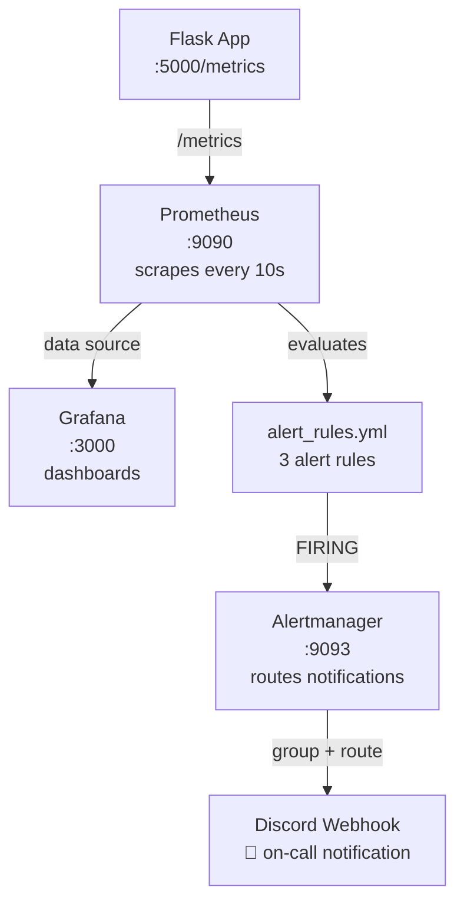
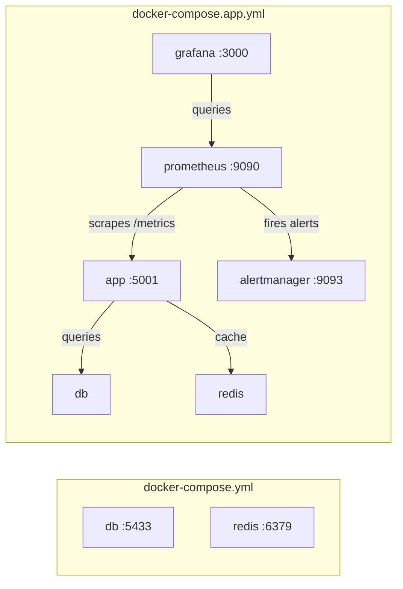

# Phase 4.2 — Incident Response Silver: Alerting & Monitoring Stack Decision Log

> How we wired up Prometheus, Grafana, and Alertmanager to detect failures before users do — and **why** each decision was made.

---

## What We Built

_Prometheus scrapes the Flask `/metrics` endpoint every 10 seconds, evaluates three alert rules every 15 seconds, and fires to Alertmanager when a condition holds for the configured duration. Alertmanager groups alerts, deduplicates, and routes to Discord. Grafana queries Prometheus for dashboard panels._

---

## ADR-1: Why Prometheus + Grafana + Alertmanager instead of a paid APM?

**Context:** Datadog, New Relic, and other SaaS APMs would give us dashboards and alerts out of the box. But they cost money, require account setup, and tie us to a vendor.

**Decision:** Use the Prometheus + Grafana + Alertmanager stack — the industry-standard open-source observability triad.

**Rationale:**

- **Zero cost** — all three are free, open-source, and run in Docker
- **Zero vendor lock-in** — PromQL is a transferable skill; dashboards export as JSON
- **Already instrumented** — Phase 4.1 added `prometheus-flask-exporter`, so `/metrics` already exposes `flask_http_request_total`, `flask_http_request_duration_seconds`, and `up`. No code changes needed.
- **Resume value** — "Prometheus + Grafana" on a resume means something to every SRE hiring manager

**Trade-offs:**

- We maintain the config ourselves (YAML files instead of a UI wizard)
- No built-in APM traces (acceptable at this scale)
- Alertmanager is a separate moving part to debug

---

## ADR-2: Why 10-second scrape interval instead of the default 15s?

**Context:** Prometheus defaults to `scrape_interval: 15s`. For a hackathon demo, 15 seconds feels sluggish — graphs update slowly and alerts take longer to fire.

**Decision:** Set `scrape_interval: 10s` for the `url-shortener` job while keeping the global default at 15s.

**Rationale:**

- Faster scrapes mean Grafana dashboards refresh more responsively during the live demo
- 10s is still well within safe territory (Prometheus can handle sub-second scrapes)
- Per-job override keeps the option to add low-priority jobs at the global 15s default later

**Trade-offs:**

- Slightly higher disk usage on Prometheus (negligible at this scale)
- `/metrics` gets hit slightly more often (Flask handles it in <1ms)

---

## ADR-3: Why three specific alert rules (ServiceDown, HighErrorRate, HighLatency)?

**Context:** We need alerts that demonstrate real incident detection without generating noise. The three rules map directly to the SRE golden signals.

**Decision:** Define exactly three alerts:

| Alert             | Expression                       | For | Severity |
| ----------------- | -------------------------------- | --- | -------- |
| **ServiceDown**   | `up{job="url-shortener"} == 0`   | 1m  | critical |
| **HighErrorRate** | `rate(5xx) / rate(total) > 0.05` | 2m  | warning  |
| **HighLatency**   | `p95 > 1s`                       | 5m  | warning  |

**Rationale:**

- **ServiceDown** catches total outages — the container is dead or unreachable. The `for: 1m` avoids flapping on a single failed scrape during restarts.
- **HighErrorRate** catches code bugs or DB failures causing 5xx responses. The 5% threshold over 2 minutes filters out one-off errors (a single 500 in a burst of requests won't trigger it).
- **HighLatency** catches performance regressions. The `p95 > 1s for 5m` window means only sustained slowdowns fire — not a single slow query during a GC pause.

**What we explicitly chose NOT to alert on:**

- 4xx rates — those are client errors (bad input), not our problem
- Disk usage — out of scope for a hackathon app
- Individual endpoint failures — too granular; the aggregate error rate catches them

**Trade-offs:**

- `for: 1m` on ServiceDown means we tolerate 1 minute of downtime before alerting (acceptable for a non-paged hackathon project)
- The error rate formula returns `NaN` when there's zero traffic (Prometheus handles this correctly — NaN is not > 0.05, so no false alarm)

---

## ADR-4: Why Alertmanager routes to Discord instead of email/PagerDuty?

**Context:** The team already uses Discord for coordination. Email is slow. PagerDuty requires an account and API key setup.

**Decision:** Use Alertmanager's native `discord_configs` receiver with a webhook URL.

**Rationale:**

- **Instant delivery** — Discord notifications pop up on phone and desktop within seconds
- **Native support** — Alertmanager has built-in Discord integration; no custom webhook adapter needed
- **Visual** — Discord renders the alert title and description in a formatted embed
- **Team-wide** — the alert channel is visible to everyone, not just the on-call person

**Configuration choices:**

- `group_wait: 10s` — wait 10 seconds to batch related alerts into one message (avoids spam)
- `group_interval: 10s` — send new alerts every 10 seconds during an ongoing incident
- `repeat_interval: 1h` — re-send an unresolved alert every hour (not every 10s)
- `group_by: ["alertname"]` — group by alert name so ServiceDown and HighErrorRate are separate messages

**Trade-offs:**

- Discord webhooks have no acknowledgment flow (can't "ack" an alert like PagerDuty)
- The webhook URL is a placeholder — needs to be replaced with a real Discord webhook before the demo

---

## ADR-5: Why Grafana is auto-provisioned instead of manually configured?

**Context:** Grafana dashboards and data sources can be configured through the UI, but that state lives inside the container's volume. Rebuilding the container loses everything.

**Decision:** Use Grafana's file-based provisioning system:

- `monitoring/grafana/datasources/prometheus.yml` — auto-configures Prometheus as the default data source
- `monitoring/grafana/dashboards/dashboard.yml` — tells Grafana where to find dashboard JSON files

**Rationale:**

- **Reproducible** — `docker-compose up` gives you a fully configured Grafana on first boot, no manual clicking
- **Version-controlled** — datasource config lives in the repo, not in a Docker volume
- **Demo-safe** — even if the Grafana volume is deleted, the data source reconnects automatically

**Trade-offs:**

- Dashboard JSON must be exported and committed manually (no auto-save from UI to repo)
- Provisioned data sources can't be deleted from the Grafana UI (by design — prevents accidental removal)

---

## ADR-6: Why the monitoring stack is in `docker-compose.app.yml` (not the dev `docker-compose.yml`)?

**Context:** The dev `docker-compose.yml` runs only `db` and `redis` for local development (`uv run run.py` runs the app natively). The monitoring stack (Prometheus, Grafana, Alertmanager) needs to scrape the app inside the same Docker network.

**Decision:** Add the full monitoring stack to `docker-compose.app.yml` alongside the containerized app, DB, and Redis.

**Rationale:**

- Prometheus scrapes `app:5000` using Docker's internal DNS — this only works if both containers are on the same Docker Compose network
- The dev `docker-compose.yml` doesn't run the app in Docker (it's just `db` + `redis`), so Prometheus couldn't reach `app:5000`
- `docker-compose.app.yml` is already the "production-like" stack used for chaos demos and load testing — monitoring belongs here

**Architecture after this change:**

**Trade-offs:**

- Running `docker-compose -f docker-compose.app.yml up` starts 6 containers (heavier than dev mode)
- The dev `docker-compose.yml` also declares the monitoring services for reference, but they'll only scrape successfully when run with the app compose file

---

## Quick Reference: What Each Piece Does

| Component        | Port | Purpose                                                                 | Config File                   |
| ---------------- | ---- | ----------------------------------------------------------------------- | ----------------------------- |
| **Prometheus**   | 9090 | Scrapes `/metrics`, stores time-series data, evaluates alert rules      | `monitoring/prometheus.yml`   |
| **Alertmanager** | 9093 | Receives firing alerts from Prometheus, deduplicates, routes to Discord | `monitoring/alertmanager.yml` |
| **Grafana**      | 3000 | Dashboards — queries Prometheus for charts and panels                   | `monitoring/grafana/`         |
| **Alert Rules**  | —    | Defines ServiceDown, HighErrorRate, HighLatency thresholds              | `monitoring/alert_rules.yml`  |

---

## ADR-7: Alerting latency budget — how fast does an alert reach the operator?

**Context:** The hackathon rubric requires alerting latency to be documented and meet a five-minute response objective.

**Decision:** Model the worst-case end-to-end latency for the `ServiceDown` alert (the fastest-firing rule):

| Stage                                 | Source                                        | Duration          |
| ------------------------------------- | --------------------------------------------- | ----------------- |
| Scrape interval                       | `prometheus.yml` → `scrape_interval: 10s`     | 10s               |
| Rule evaluation interval              | `prometheus.yml` → `evaluation_interval: 15s` | 15s               |
| Alert `for` period (must stay FIRING) | `alert_rules.yml` → `for: 1m`                 | 60s               |
| Alertmanager group wait               | `alertmanager.yml` → `group_wait: 10s`        | 10s               |
| **Worst-case total**                  |                                               | **95s (~1m 35s)** |

**Rationale:**

- Worst case: the failure happens 1ms after a scrape completes → we wait a full 10s for the next scrape, then up to 15s for the next evaluation cycle, then 60s of sustained failure to confirm it's not a flap, then 10s for Alertmanager to batch and send.
- 95 seconds is well within the **5-minute (300s) response objective** — we have 3× headroom.
- The fire drill in the checklist below validates this timing in practice.

**Trade-offs:**

- Reducing `for: 1m` to `for: 0s` would alert in ~25s but would generate false alarms during normal rolling restarts.
- The 10s scrape interval (vs default 15s) deliberately shaves 5s off the worst-case path.

---

## Alert Fire Drill Checklist

1. Start the full stack: `docker-compose -f docker-compose.app.yml up -d --build`
2. Verify Prometheus targets: open `http://localhost:9090/targets` — `url-shortener` should be `UP`
3. Verify Grafana: open `http://localhost:3000` (admin / hackathon) — Prometheus data source should be green
4. Stop the app: `docker-compose -f docker-compose.app.yml stop app`
5. Wait ~1 minute — Prometheus detects the scrape failure
6. Check Prometheus alerts: `http://localhost:9090/alerts` — `ServiceDown` should show `FIRING`
7. Check Discord — notification should arrive within 2 minutes
8. Restart the app: `docker-compose -f docker-compose.app.yml start app`
9. Alert resolves — Discord gets a resolution message

