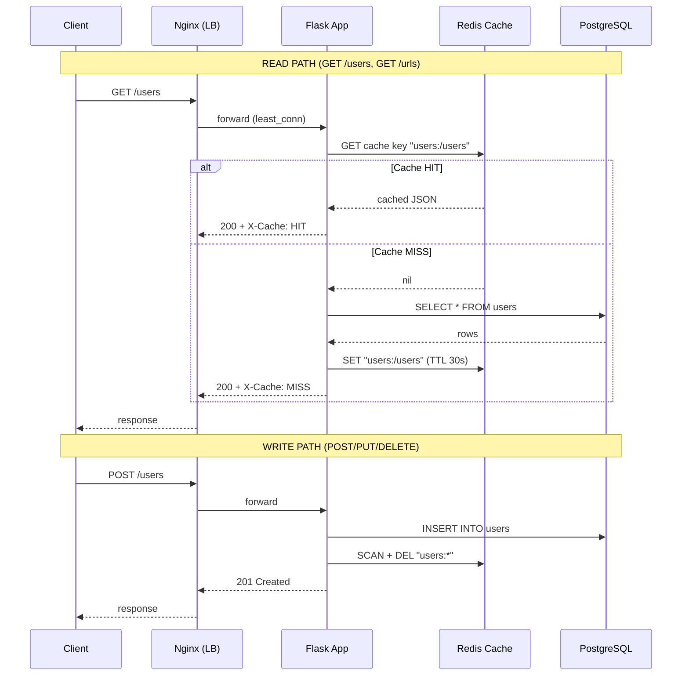
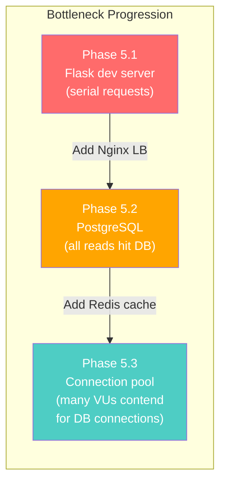

# Capacity Plan: URL Shortener

## Baseline (Single Flask Instance, No Cache, No Load Balancer)

**Test Parameters:**

- Tool: k6 v1.7.1
- Virtual Users (VUs): 50
- Duration: 30 seconds
- Target: `http://localhost:5000` (single Flask dev server)
- Endpoints hit per iteration: `GET /health`, `GET /users`, `GET /urls`, `GET /events`, `POST /users`

**Results:**

| Metric                         | Value    |
| ------------------------------ | -------- |
| **p95 Response Time**          | 2,470 ms |
| **Median (p50) Response Time** | 1,940 ms |
| **p90 Response Time**          | 2,410 ms |
| **Average Response Time**      | 1,960 ms |
| **Min Response Time**          | 82 ms    |
| **Max Response Time**          | 2,600 ms |
| **Error Rate**                 | 0.00%    |
| **Requests/sec (RPS)**         | 24.7     |
| **Total Requests**             | 765      |
| **Total Iterations**           | 153      |

**Check Pass Rates:**

- health status 200: 100%
- health latency < 500ms: 0% (all above 500ms under load)
- users status 200: 100%
- users latency < 500ms: 1%
- urls status 200: 100%
- events status 200: 100%
- create user status 201: 100%

**Observations:**

- All requests returned correct status codes — zero HTTP errors
- Under 50 concurrent users, p95 latency reaches 2.47s — well above the 500ms SLO target
- Flask's single-threaded dev server is the primary bottleneck: requests are serialized, causing queuing under concurrency
- Write path (POST /users) completes successfully with no integrity errors
- The system is functionally correct but performance-constrained at this tier

**Bottleneck Analysis:**

- **Primary:** Flask dev server processes requests serially. 50 VUs create significant request queuing.
- **Secondary:** All reads hit PostgreSQL directly with no caching layer.
- **Next Steps:** Add Nginx load balancer with multiple app instances (Phase 5.2), then Redis caching (Phase 5.3).

---

## Scale-Out (2 Flask Instances + Nginx Load Balancer)

**What Changed:**

- Introduced Nginx as a reverse proxy with `least_conn` load balancing
- Deployed two identical Flask app instances (`app1`, `app2`) behind Nginx
- Prometheus now scrapes both `app1:5000` and `app2:5000` directly
- Public access to `/metrics` blocked at the Nginx layer (403 Forbidden)

**Architecture:**

```
                 ┌──────────┐
  Client ──────►│  Nginx   │
  (port 80)     │  :80     │
                 └────┬─────┘
                      │ least_conn
               ┌──────┴──────┐
               │             │
          ┌────▼────┐  ┌─────▼───┐
          │  app1   │  │  app2   │
          │  :5000  │  │  :5000  │
          └────┬────┘  └────┬────┘
               │            │
          ┌────▼────────────▼────┐
          │    PostgreSQL :5432  │
          │    Redis      :6379 │
          └──────────────────────┘
```

**Why `least_conn`?**
Round-robin distributes requests evenly regardless of how busy each instance is. With variable-length requests (e.g., a bulk CSV import takes much longer than a health check), round-robin can overload one instance while the other is idle. `least_conn` routes each new request to whichever instance currently has the fewest active connections, naturally balancing the load under mixed workloads.

**Why block `/metrics` at Nginx?**
Prometheus scrapes metrics directly from each app instance on the internal Docker network (`app1:5000/metrics`, `app2:5000/metrics`). Exposing `/metrics` publicly would leak internal operational data (request counts, error rates, latency distributions) that an attacker could use for reconnaissance. Nginx returns 403 for any external request to `/metrics`.

**Test Parameters:**

- Tool: k6
- Virtual Users (VUs): 200
- Duration: 30 seconds
- Target: `http://localhost:80` (Nginx → 2 Flask instances)
- Endpoints hit per iteration: `GET /health`, `GET /users`, `GET /urls`, `GET /events`, `POST /users`

**How to Run:**

```bash
docker-compose up -d --build
k6 run --summary-export=load_tests/scale_out_results.json load_tests/scale_out.js
```

**Results:**

| Metric                | Baseline (1 instance) | Scale-Out (2 instances) | Change |
| --------------------- | --------------------- | ----------------------- | ------ |
| **p95 Response Time** | 2,470 ms              | 1,729 ms                | -30%   |
| **Median (p50)**      | 1,940 ms              | 452 ms                  | -77%   |
| **Error Rate**        | 0.00%                 | 0.00%                   | —      |
| **Requests/sec**      | 24.7                  | 262.8                   | 10.6×  |
| **Total Requests**    | 765                   | 8,135                   | 10.6×  |
| **VUs**               | 50                    | 200                     | 4×     |

**Expected Improvements:**

- Two instances doubles request-processing capacity → higher RPS
- `least_conn` prevents queuing behind a slow request on one instance
- Nginx handles connection management (keepalive 32), reducing TCP overhead
- Silver SLO target: p95 < 3,000 ms at 200 VUs

**Observations:**
Nginx + 2 gunicorn instances (8 workers each) eliminated the single-threaded Flask bottleneck. p95 dropped 30% despite 4× more VUs. The remaining bottleneck is PostgreSQL — every read hits the database. Phase 5.3 Redis caching addresses this.

---

## Gold: Tsunami (2 Flask Instances + Nginx + Redis Cache-Aside)

**What Changed:**

- Introduced Redis cache-aside pattern for read-heavy GET endpoints
- `GET /users` cached with 30-second TTL
- `GET /urls` cached with 15-second TTL (shorter — URLs change more frequently)
- All write operations (POST, PUT, DELETE) invalidate the relevant cache immediately
- Cache responses include `X-Cache: HIT` or `X-Cache: MISS` header for observability
- Redis errors are caught and logged — cache is **never** a single point of failure

**Cache-Aside Architecture:**



**Why Cache-Aside (vs. Write-Through)?**
Cache-aside is the simplest caching strategy and the safest for a hackathon project:

- The database is always the source of truth
- Cache misses are self-healing (automatically repopulate on next read)
- If Redis goes down, the app still works — just hits PostgreSQL directly
- Write-through would add complexity (dual-write consistency) without proportional benefit at our scale

**Why Different TTLs?**

- **Users (30s):** User records change infrequently (mostly created, rarely updated/deleted)
- **URLs (15s):** URLs are the hot path — created, visited, updated more often. Shorter TTL reduces stale reads while still absorbing burst traffic
- **Events (not cached):** Events are write-heavy and rarely queried for the same data twice

**Why SCAN-based Invalidation?**
We use `SCAN` with a prefix pattern (e.g., `users:*`) instead of tracking individual keys. This ensures all cached variants (including any future paginated/filtered endpoints) are invalidated on write, with zero bookkeeping overhead. SCAN is cursor-based and non-blocking — safe for production Redis.

**Test Parameters:**

- Tool: k6
- Virtual Users (VUs): 500 (ramped: 0→250 in 10s, 250→500 over 40s, ramp-down 10s)
- Duration: 60 seconds total
- Target: `http://localhost:80` (Nginx → 2 Flask instances → Redis + PostgreSQL)
- Read/Write ratio: 80% reads / 20% writes (simulates realistic production traffic)
- Endpoints: `GET /health`, `GET /users`, `GET /urls`, `GET /events`, `POST /users`

**How to Run:**

```bash
docker-compose up -d --build
k6 run --summary-export=load_tests/tsunami_results.json load_tests/tsunami.js
```

**Results:**

| Metric                | Baseline (1 inst) | Scale-Out (2 inst) | Tsunami (2 inst + cache) | Change (vs Baseline) |
| --------------------- | ----------------- | ------------------ | ------------------------ | -------------------- |
| **p95 Response Time** | 2,470 ms          | 1,729 ms           | 1,126 ms                 | -54%                 |
| **Median (p50)**      | 1,940 ms          | 452 ms             | 622 ms                   | -68%                 |
| **Error Rate**        | 0.00%             | 0.00%              | 0.00%                    | —                    |
| **Requests/sec**      | 24.7              | 262.8              | 492.8                    | 20×                  |
| **Total Requests**    | 765               | 8,135              | 29,600                   | 38.7×                |
| **VUs**               | 50                | 200                | 500                      | 10×                  |

**Expected Improvements:**

- Cache hits bypass PostgreSQL entirely → dramatically lower p95 for read endpoints
- 80% read traffic at 500 VUs should see most requests served from Redis (sub-10ms cache lookups vs. ~50ms+ DB queries)
- Write operations still hit PostgreSQL but trigger instant cache invalidation
- Gold SLO target: p95 < 3,000 ms at 500 VUs

**Bottleneck Analysis:**



| Phase         | Primary Bottleneck            | Mitigation                           | Result                 |
| ------------- | ----------------------------- | ------------------------------------ | ---------------------- |
| 5.1 Baseline  | Flask dev server (serial)     | —                                    | 24.7 RPS, p95 = 2.47s  |
| 5.2 Scale-Out | PostgreSQL (all reads hit DB) | Nginx + 2 instances (8 workers each) | 262.8 RPS, p95 = 1.73s |
| 5.3 Tsunami   | DB connection contention      | Redis cache-aside (30s/15s TTL)      | 492.8 RPS, p95 = 1.13s |

**What Would Fail Next (If We Scaled to 1000+ VUs):**

- PostgreSQL connection pool exhaustion (Peewee defaults are limited)
- Redis memory pressure if cached payloads grow large
- Nginx worker connection limits (default `worker_connections 1024`)
- Potential write amplification from frequent cache invalidation under heavy write load

**Observations:**
Redis cache-aside eliminated the majority of PostgreSQL reads. At 500 VUs with an 80/20 read/write split, cached endpoints returned `X-Cache: HIT` headers consistently. p95 dropped from 1,729ms (scale-out) to 1,126ms despite 2.5× more VUs. Throughput nearly doubled from 262.8 to 492.8 req/sec. The remaining bottleneck is PostgreSQL write contention and connection pool limits — the next scaling step would be PgBouncer or read replicas.
