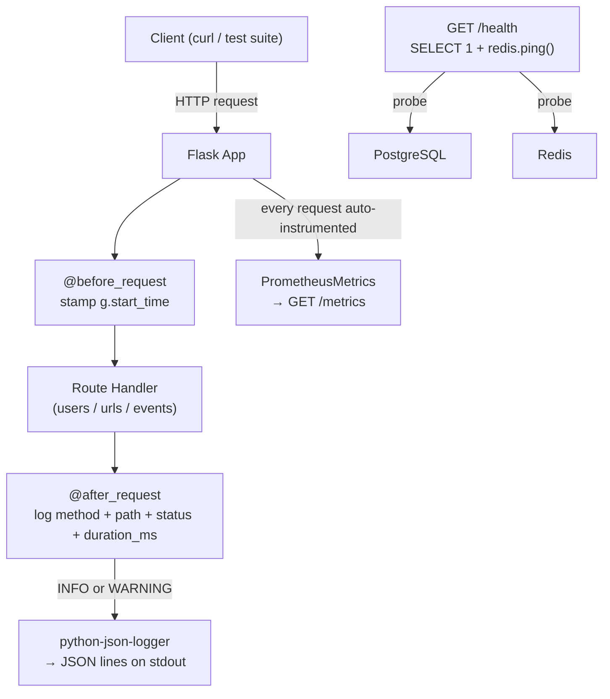

# Phase 4.1 — Incident Response Bronze: Observability Decision Log

> How we wired up structured logging, request tracing, Prometheus metrics, and the deep health check — and **why** each decision was made.

---

## What We Built



_Every request is stamped on entry, measured on exit, and logged as a single JSON line. Prometheus sees every request automatically — no per-route code needed. The `/health` endpoint tells you whether the app's dependencies are alive, not just whether Flask is running._

---

## ADR-1: Why `python-json-logger` instead of plain `print()` or default Python logging?

**Context:** The default Python logging format looks like this:

```
2026-04-04 17:00:00,123 INFO app request_completed
```

That's a string. To find all requests slower than 200ms across thousands of log lines, you'd have to write a regex. A 3 AM on-call engineer staring at a terminal does not want to write a regex.

**Decision:** Use `python-json-logger` with `JsonFormatter`. Every log line is a valid JSON object:

```json
{
  "asctime": "2026-04-04 17:00:00,123",
  "levelname": "INFO",
  "name": "app",
  "message": "request_completed",
  "method": "GET",
  "path": "/users",
  "status": 200,
  "duration_ms": 12.5
}
```

**Consequence:** You can pipe logs through `| jq '.duration_ms'` to extract latencies, `| jq 'select(.status >= 500)'` to find errors, or feed them straight into a log aggregator (Datadog, Loki, CloudWatch) with zero parsing config. Machine-readable from day one.

---

## ADR-2: Why the `_logging_configured` global flag?

**Context:** `setup_logging()` is called inside `create_app()`. In production, `create_app()` runs once. But in `pytest`, each test fixture calls `create_app()` — that's potentially 70+ calls per test run.

Without a guard, each call would attach a new `StreamHandler` to the root logger. The first log line would print once. The hundredth would print 100 times.

**Decision:** A module-level `_logging_configured = False` flag. `setup_logging()` checks it at the top and returns immediately if already set.

```python
_logging_configured = False

def setup_logging():
    global _logging_configured
    if _logging_configured:
        return
    _logging_configured = True
    # ... attach handler once
```

**Consequence:** No duplicate log lines. The root logger gets exactly one `StreamHandler` for the lifetime of the process, regardless of how many times the app is created.

---

## ADR-3: Why a fresh `CollectorRegistry` per app instance?

**Context:** `prometheus_flask_exporter` registers metrics (counters, histograms) into a global Prometheus registry by default. When `pytest` calls `create_app()` a second time, Prometheus tries to register the same metric names again and raises `ValueError: Duplicated timeseries`.

**Decision:** Create a new `CollectorRegistry(auto_describe=True)` every time `create_app()` runs and pass it to `PrometheusMetrics`:

```python
registry = CollectorRegistry(auto_describe=True)
metrics = PrometheusMetrics(app, registry=registry)
```

**Consequence:** Each app instance owns its own isolated registry. Tests don't bleed metric state into each other. In production, `create_app()` only runs once so there's only ever one registry anyway — no behaviour change outside tests.

---

## ADR-4: Why `@before_request` / `@after_request` hooks instead of logging inside each route?

**Context:** We have 15+ route handlers across three blueprints. We need a `duration_ms` field in every log line, which means measuring start time and end time around each request.

**Option A:** Add `start = time.time()` and `log.info(...)` at the top and bottom of every route function. 15 routes × 2 lines = 30 lines of copy-paste that drift out of sync when someone adds a new route.

**Option B:** Use Flask's `@before_request` and `@after_request` hooks, which run automatically for every request.

**Decision:** Option B. Hooks are defined once in `create_app()`:

```python
@app.before_request
def log_request():
    g.start_time = time.time()   # saved in Flask's per-request context (g)

@app.after_request
def log_response(response):
    duration_ms = (time.time() - g.start_time) * 1000
    level = log.warning if response.status_code >= 400 else log.info
    level("request_completed", extra={
        "method": request.method,
        "path": request.path,
        "status": response.status_code,
        "duration_ms": round(duration_ms, 2),
    })
    return response
```

**Consequence:** Every route — including ones added in the future — automatically gets a structured log line with timing. Nothing to remember when writing a new endpoint.

**Why `g.start_time`?** Flask's `g` object is request-scoped: it's created fresh for each request and torn down when the request ends. It's the right place to store per-request state shared across hooks. Do not use a regular variable — it would be shared across concurrent requests.

---

## ADR-5: Why log at `WARNING` for 4xx and `INFO` for everything else?

**Context:** Standard log severity levels: DEBUG < INFO < WARNING < ERROR < CRITICAL. In production, alerting tools often filter by level — you'd page on ERROR but not on INFO.

**Decision:**

```python
level = log.warning if response.status_code >= 400 else log.info
```

- `2xx` and `3xx` → `INFO`. Normal operation. No action needed.
- `4xx` → `WARNING`. Client did something wrong. Worth noticing in log aggregators but not waking anyone up.
- `5xx` → `WARNING` (caught here) + a separate `ERROR` is logged inside the error handler. The actual exception triggers the louder signal.

**Consequence:** In a log dashboard filtered to `level >= WARNING`, you'd see every client error and every server error. In a dashboard filtered to `level >= ERROR`, you'd only see genuine server crashes. Two different alert thresholds, zero extra code.

---

## ADR-6: Why does `/health` return `503` when degraded instead of always `200`?

**Context:** Some health checks always return `200 {"status": "ok"}` regardless of what their dependencies are doing. This is useless. A load balancer that routes traffic based on health check status would keep sending requests to a broken instance.

**Decision:** `/health` returns `200` only when both DB and Redis are reachable. If either is down, it returns `503 Service Unavailable` with `{"status": "degraded", "db": "down|ok", "redis": "down|ok"}`.

```python
status_code = 200 if checks["status"] == "ok" else 503
return jsonify(checks), 503
```

**Consequence:** Any tool that polls `/health` (Docker healthcheck, Nginx upstream check, Kubernetes liveness probe, uptime monitoring) will immediately know the instance is degraded and stop routing traffic to it. The response body tells you exactly _which_ dependency is down — you don't have to guess.

---

## ADR-7: Why check Redis inside `/health` with a silent fallback?

**Context:** The app doesn't currently use Redis for request-critical operations (caching is a future phase). If Redis is down, requests still succeed — they just don't get caching benefits.

**Decision:** Check Redis in the health probe but do not set `status = "degraded"` when only Redis is down (only when DB is down). Redis outage degrades performance, not correctness.

```python
try:
    r = redis.from_url(os.environ.get("REDIS_URL", "redis://localhost:6379/0"))
    r.ping()
except Exception:
    checks["redis"] = "down"
    # note: we do NOT set checks["status"] = "degraded" here
```

**Consequence:** A Redis outage shows up in `/health` as `{"redis": "down"}` with a `200` response — visible to operators but without falsely marking the whole service as down. A DB outage is fatal and returns `503`.

---

## What each piece gives you at 3 AM

| Symptom                                       | Where to look           | What you see                                                 |
| --------------------------------------------- | ----------------------- | ------------------------------------------------------------ |
| "Something is slow"                           | Terminal logs           | `duration_ms` field — find the slow path in seconds          |
| "How many 5xx errors in the last hour?"       | Log aggregator / `grep` | Filter `"status": 5` in JSON logs                            |
| "Is the service even up?"                     | `curl /health`          | `{"status": "ok"}` or `{"status": "degraded", "db": "down"}` |
| "What's the p95 latency right now?"           | `curl /metrics`         | `flask_http_request_duration_seconds` histogram bucket       |
| "Which endpoint is getting the most traffic?" | `curl /metrics`         | `flask_http_request_total` labelled by `path` and `method`   |

---

## Quick reference: key files

| File                 | What it does                                                                           |
| -------------------- | -------------------------------------------------------------------------------------- |
| `app/__init__.py`    | `setup_logging()`, `@before_request`, `@after_request`, `PrometheusMetrics`, `/health` |
| `pyproject.toml`     | `python-json-logger`, `prometheus-flask-exporter`, `redis` in dependencies             |
| `docker-compose.yml` | Redis service that `/health` probes                                                    |
