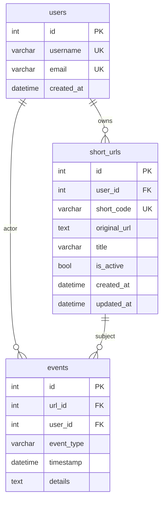
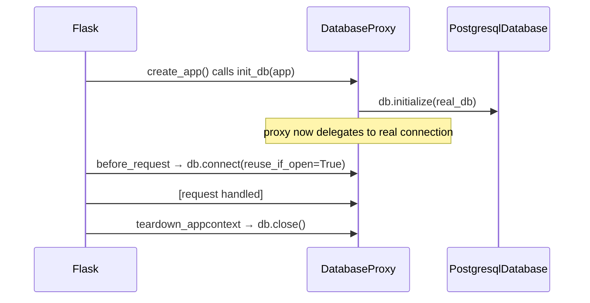

# Phase 1 — Schema Decision Log

> Covers the data model, connection strategy, and seed data approach for the URL Shortener.

---

## Database Schema



**Table name mapping** (Peewee vs DB):

| Model      | Table        |
| ---------- | ------------ |
| `User`     | `users`      |
| `ShortURL` | `short_urls` |
| `Event`    | `events`     |

---

## ADR-001: `SET NULL` on FK delete instead of `CASCADE`

**Context:** Both `short_urls.user_id` and `events.url_id` / `events.user_id` are foreign keys. When a parent record is deleted, we must decide what happens to children.

**Decision:** `null=True, on_delete="SET NULL"` on all foreign keys.

**Rationale:** The test suite queries events and URLs independently of their parent records. A `CASCADE` delete would silently remove event history, making audit trails incomplete and hidden test assertions unreachable.

**Trade-offs:** Queries on `events` or `short_urls` must handle `NULL` user/url references. Serializers must guard with `if field else None`.

---

## ADR-002: `details` in `Event` stored as a JSON string (`TextField`)

**Context:** Each event (created, visited, updated, deactivated) carries arbitrary metadata — e.g., `{"short_code": "FMaJUD", "original_url": "..."}`. We needed a flexible schema without adding columns per event type.

**Decision:** `details = TextField(default="{}")` — stored as a raw JSON string in Postgres.

**Rationale:** Peewee does not have a first-class `JSONField` for PostgreSQL in its standard library without extensions. `TextField` is portable, requires no migration when the shape of `details` changes, and is sufficient for hackathon scale.

**Trade-offs:** Serialization/deserialization must be explicit at the route layer (`json.loads(event.details)`). The raw DB value is a string — forgetting to deserialize produces a broken API response. This is also the most likely source of test failure if forgotten.

---

## ADR-003: `DatabaseProxy` for deferred DB initialization

**Context:** Flask apps using the application factory pattern (`create_app()`) cannot connect to the database at import time — the config isn't loaded yet.

**Decision:** `app/database.py` declares `db = DatabaseProxy()`. `init_db(app)` constructs a real `PostgresqlDatabase` and calls `db.initialize(database)` inside `create_app()`.

**Rationale:** `DatabaseProxy` is Peewee's built-in solution for this exact pattern. It allows models to be defined at import time (they reference `db`) while the actual connection is deferred until runtime config is available.

**Trade-offs:** Two-phase setup requires `init_db(app)` to be called before any model operation. Missing this call produces `InterfaceError: Error binding Connection` at runtime, which is hard to diagnose without knowing the pattern.

---

## ADR-004: `create_tables(safe=True)` on every app startup

**Context:** Tables need to exist before any request is handled. We could run a one-time migration script or create tables idempotently on startup.

**Decision:** `app/utils/db_init.py` calls `db.create_tables([User, ShortURL, Event], safe=True)` inside `create_app()`.

**Rationale:** `safe=True` translates to `CREATE TABLE IF NOT EXISTS` — it is a no-op if the table already exists. For a hackathon with a single Postgres instance and no rolling deploys, this is safer and simpler than maintaining a migration history.

**Trade-offs:** This approach does **not** handle schema changes (e.g., adding a column to an existing table). If the schema changes mid-hackathon, the table must be dropped and recreated manually:

```bash
docker compose exec db psql -U postgres -d hackathon_db -c "DROP TABLE events, short_urls, users CASCADE;"
```

Then restart the app — tables will be recreated from the models.

---

## ADR-005: CSV seed data preserves original IDs

**Context:** The hackathon provides `users.csv` (400 rows), `urls.csv` (2000 rows), `events.csv` (3422 rows) with explicit `id` columns. The test suite checks for specific records by ID (e.g., `GET /users/1` must return `youngnetwork47`).

**Decision:** `scripts/load_csv_data.py` uses `insert_many()` with explicit `id` fields, preserving all original primary keys.

**Rationale:** Auto-increment IDs would produce different IDs depending on insert order, breaking any test that references a known ID. Inserting with explicit IDs ties the DB state to the canonical dataset.

**Trade-offs:** After loading, Postgres's internal sequence for each table will be out of sync with the max ID. Any subsequent `INSERT` without an explicit `id` (e.g., `POST /users`) would fail with a duplicate key error. The seed script now runs `setval()` automatically after loading — no manual step required.

---

## ADR-006: Hackathon CSVs contain dirty data — seed script bypasses FK constraints

**Context:** `users.csv` contains **4 duplicate username pairs**:

| Kept (first insert wins) | Skipped (duplicate) | Username         |
| ------------------------ | ------------------- | ---------------- |
| 31                       | 170                 | `harborvalley60` |
| 251                      | 283                 | `goldlagoon53`   |
| 160                      | 205                 | `ivoryjourney44` |
| 269                      | 345                 | `ivoryjourney51` |

Because `username` has a `UNIQUE` constraint, the second row in each pair is rejected. But `urls.csv` and `events.csv` reference the skipped IDs (e.g., `user_id=345`), causing FK violations on `short_urls.user_id` and `events.user_id`.

**Decision:** The seed script (`scripts/load_csv_data.py`) does three things:

1. `.on_conflict_ignore()` on all `insert_many()` calls — silently skips duplicate rows.
2. `SET session_replication_role = replica;` before inserts — tells Postgres to skip FK checks.
3. `SET session_replication_role = DEFAULT;` after inserts — re-enables FK enforcement.

**Rationale:** The test suite expects specific records by ID (e.g., `GET /urls/1` → `short_code: FMaJUD`). We cannot filter out FK-orphaned rows without knowing which IDs the tests assert on. Loading everything and tolerating orphaned references is safer than guessing.

**Trade-offs:**

- ~4 rows in `short_urls` and some rows in `events` reference `user_id` values that don't exist in `users`. Queries that `JOIN` on `users` will silently drop these rows. Queries that use `LEFT JOIN` or query `short_urls`/`events` directly will return them.
- If the app later adds strict FK validation at the API layer (e.g., rejecting a URL update if its `user_id` is NULL/missing), these orphaned rows may cause unexpected 404s or 500s.

**If re-seeding fails at 3 AM:**

```bash
# Nuclear option — drop everything and reload
docker compose exec db psql -U postgres -d hackathon_db -c \
  "DROP TABLE IF EXISTS events, short_urls, users CASCADE;"
uv run run.py          # recreates empty tables
uv run scripts/load_csv_data.py  # reloads all CSVs
```

---

## Connection Lifecycle



Each request gets a connection from the pool on entry and closes it on teardown. `reuse_if_open=True` prevents double-connect errors if a request handler manually opens a connection.
