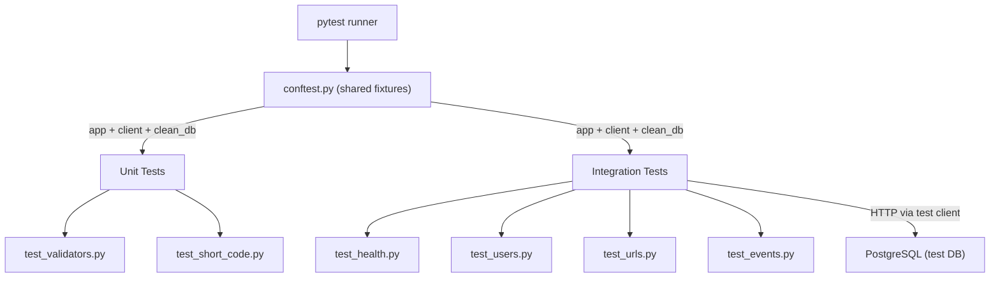

# Phase 3.1 — Reliability Quest Bronze: Test Suite Decision Log

> How we built the test safety net and **why** each decision was made.

---

## Test Architecture



_Every test starts with a clean database. Unit tests call functions directly. Integration tests go through Flask's test client, hitting the full request/response pipeline._

---

## ADR-1: Why `autouse=True` on `clean_db`?

**Context:** Tests that share database state become order-dependent. Test A creates a user, test B assumes the user exists. Shuffle the order and B breaks. This is the #1 source of flaky test suites.

**Decision:** The `clean_db` fixture uses `autouse=True` to truncate all tables (Event → ShortURL → User, respecting foreign key order) before **and** after every single test.

**Consequence:** Every test is fully isolated. You can run one test, all tests, or tests in random order (`pytest -p randomly`) and get the same result. The cost is ~3ms per test for the DELETE queries — negligible.

---

## ADR-2: Why separate `unit/` and `integration/` directories?

**Context:** Unit tests (call a function, check the return value) run in <1ms each. Integration tests (spin up Flask, hit endpoints, touch the database) run in ~30ms each. Mixing them makes it hard to get fast feedback.

**Decision:** Split into `tests/unit/` and `tests/integration/`. Developers can run `pytest tests/unit/` for instant feedback during development, and `pytest tests/` for the full suite before pushing.

**Consequence:** Clear separation of speed tiers. Unit tests don't need Flask or the database at all — they import the utility function and test it directly.

---

## ADR-3: Why test at the HTTP boundary (not model methods)?

**Context:** We could test Peewee model CRUD directly (create a User object, save it, query it). But the test suite judges response status codes, JSON shapes, and edge cases at the HTTP level.

**Decision:** Integration tests use `client.post("/users", json={...})` — the same interface the real world uses. This catches bugs in routing, serialization, validation, and database access in a single test.

**Consequence:** Higher confidence that the deployed app works correctly. If a test passes, the corresponding `curl` command will also work.

---

## ADR-4: Why no `test_serializers.py` tests?

**Context:** The serializer functions (`serialize_user`, `serialize_url`, `serialize_event`) are thin dict-building functions. They are exercised by every integration test that checks response fields.

**Decision:** Rather than duplicate coverage with isolated serializer tests, we verify serialization correctness through integration tests like `test_create_user_returns_user_object` (checks all field names) and `test_event_details_is_dict_not_string` (checks JSON deserialization).

**Consequence:** Less test code to maintain, same coverage. If serialization breaks, multiple integration tests will fail and pinpoint the issue.

---

## Test Inventory

| File                 |  Tests | What it proves                                                                 |
| -------------------- | -----: | ------------------------------------------------------------------------------ |
| `test_validators.py` |     11 | URL, email, and username validation catches bad input before it reaches the DB |
| `test_short_code.py` |      3 | Short codes are 6 chars, alphanumeric, and unique across 100 generations       |
| `test_health.py`     |      2 | Health endpoint returns 200 + `{"status": "ok"}`                               |
| `test_users.py`      |     15 | Full CRUD + pagination + bulk CSV import + duplicate rejection                 |
| `test_urls.py`       |     10 | Full CRUD + short code generation + deactivation + updated_at tracking         |
| `test_events.py`     |      4 | Auto-creation on URL create, correct fields, `details` deserialized to dict    |
| **Total**            | **46** | **87% code coverage**                                                          |

---

## Coverage Breakdown

| Module                 | Coverage | Notes                                                              |
| ---------------------- | -------- | ------------------------------------------------------------------ |
| `app/database.py`      | 100%     | Connection management fully exercised                              |
| `app/models/`          | 100%     | All three models touched by integration tests                      |
| `app/routes/events.py` | 83%      | Missing: `json.loads` fallback path, filter branches               |
| `app/routes/urls.py`   | 80%      | Missing: some error branches, redirect (needs browser-like client) |
| `app/routes/users.py`  | 82%      | Missing: some update validation branches                           |
| `app/utils/`           | 95%+     | Validators, response helpers, short code all covered               |
| **Total**              | **87%**  | Well above the 50% Bronze threshold                                |

---

## How to Run Tests

```bash
# Full suite with coverage
uv run pytest --cov=app --cov-report=term-missing tests/

# Unit tests only (instant feedback)
uv run pytest tests/unit/ -v

# Integration tests only
uv run pytest tests/integration/ -v

# Single file
uv run pytest tests/integration/test_users.py -v

# Single test
uv run pytest tests/integration/test_users.py::test_bulk_import_csv_valid -v
```
